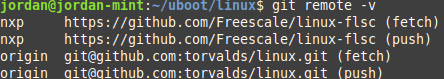

BERGER Jordan

B3 RIS, Ynnov Campus BORDEAUX

[joberger95](https://github.com/joberger95)

# DS Kernel 

## Listes des commandes et résultats

```
:~/uboot$ git clone https://github.com/Freescale/linux-fslc

:~/uboot$ cd linux

:~/uboot/linux$ git remote add nxp https://github.com/Freescale/linux-flsc

:~/uboot/linux$ git remote -v
```



```
:~/uboot/linux$ git checkout -b 5.4x+flsc

:~/uboot/linux$ export CROSS_COMPILE=/home/jordan/uboot/gcc-linaro-7.5.0-2019.12-x86_64_arm-linux-gnueabihf/bin/arm-linux-gnueabihf-

:~/uboot/linux$ make menuconfig

        Désactiver la virtualisation

:~/uboot/linux$ make ARCH=arm imx_v6_v7__defconfig

    sudo apt-get install lzop
        *mot de passe*

:~/uboot/linux$ make ARCH=arm zImage

:~/uboot/linux$ make ARCH=arm imx7s-warp.dtb
```